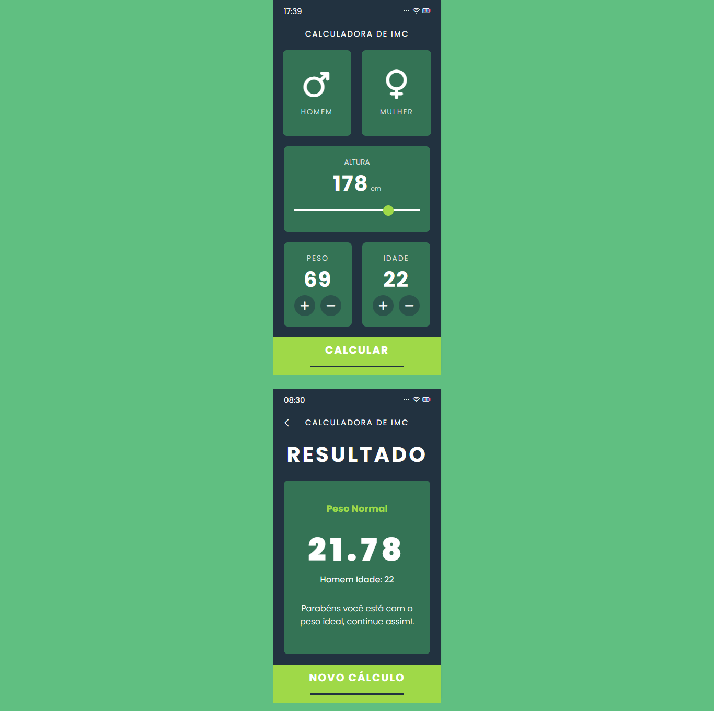

# revisao-calculadora-imc
 Recriar uma calculadora imc para revisar os conceitos aplicados no stage 5

  

## 🖥️ Projeto
Revisão do projeto da calculadora IMC

## 🚀 Tecnologias
Foi desenvolvido esse projeto com as seguintes tecnologias:

- HTML
- CSS
- JAVASCRIPT
- GIT
- GITHUB
